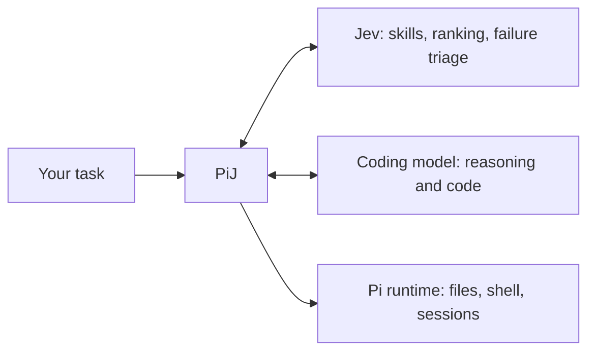

# PiJ

**A coding agent with Jev in the loop.**

[](https://github.com/tonyzdev/PiJ/actions/workflows/ci.yml)
[](LICENSE)

English | [简体中文](README.zh-CN.md)

PiJ is a terminal coding agent built on [Pi](https://github.com/earendil-works/pi), with [Jev](https://typesafe.ai/) helping select skills, rank code excerpts, and diagnose tool failures. Your coding model handles reasoning, edits, and tool use. Jev evaluates small, typed questions along the way.

**Jev for decisions. Your coding model for code.**

```text
  PiJ  v0.1.0   Fast judgment. Deliberate code.
  Jev decisions · Pi execution · your coding model

  /pij status & modes    /model coding model    /login connect
```

Early alpha. The integration is runnable, and real Jev access through Vercel Gateway has been verified. Coding-task quality, speed, and cost improvements still need comparative evaluation.

## What Jev does

| In the coding workflow | Jev's role | What PiJ preserves |
| --- | --- | --- |
| Starting a task | Shortlist skills, then check their instructions for relevance | The full skill roster and explicit user selections |
| Finding code | Rank actual file excerpts retrieved by `pij_search` | Exact paths, line numbers, source text, and retrieval limits |
| Investigating a failed tool | Classify the failure and suggest what to check next | Original output and error status; no automatic retry or permission escalation |

Suggestions stay advisory. Missing credentials, service failures, malformed answers, or timeouts leave normal coding and lexical search available. Jev scores never stand in for compilation, tests, or task acceptance.



## Quick start

Requires **Node.js 22.19+**, npm, and [ripgrep](https://github.com/BurntSushi/ripgrep) (`rg`).

```sh
git clone https://github.com/tonyzdev/PiJ.git
cd PiJ
npm ci --ignore-scripts
npm run build
npm start
```

Use `/login` to connect a coding-model provider, then `/model` to select a model. PiJ keeps its authentication, settings, and sessions in `~/.pij/agent`, separate from Pi's default home.

### Connect Jev

Copy `.env.example` to `.env` and configure **one** of these routes:

**Vercel AI Gateway**

```dotenv
PIJ_JEV_PROVIDER=vercel
AI_GATEWAY_API_KEY=your_gateway_key
```

**TypeSafe directly**

```dotenv
PIJ_JEV_PROVIDER=typesafe
TYPESAFE_API_KEY=your_typesafe_key
```

Start with the environment file explicitly loaded:

```sh
node --env-file=.env bin/pij.mjs
```

`npm start` does **not** automatically load `.env`. Run `/pij` to inspect the selected provider and decision status. `/login` configures the coding model; Jev credentials currently come from the process environment.

Gateway uses the experimental AI SDK evaluation API with `typesafe-ai/jev`. It does not require deploying PiJ to Vercel. To use Gateway credits for your coding model as well, choose a model under **`vercel-ai-gateway`** in `/model`. Selecting an `anthropic` model uses that provider's credentials and access rules.

With only a Gateway key set, PiJ selects Vercel automatically. With both keys set, TypeSafe is the default; `PIJ_JEV_PROVIDER` overrides this choice. Credentials are never reused across the two routes.

### Run in another project

Install the built checkout as a local command:

```sh
npm link --ignore-scripts
cd /path/to/your/project
pij
```

Set credentials in the launch environment, or load your environment file explicitly with Node. The npm package has not been published; install from this repository.

## Modes and commands

| Mode | Behavior |
| --- | --- |
| `assist` | Evaluate and apply skill advice, search ranking, and failure hints |
| `observe` | Evaluate and record metadata without applying results; still sends requests and incurs provider usage |
| `off` | Make no Jev requests |

Switch with `/pij assist`, `/pij observe`, or `/pij off`. Session switches are temporary; set `PIJ_MODE` or pass `--jev-mode` to choose the launch mode.

| Command | Purpose |
| --- | --- |
| `pij` or `pij "your task"` | Interactive coding session |
| `pij -p "your task"` | Run once and print the result |
| `pij doctor` | Local setup checks; no network request or credential validation |
| `pij decisions` | Inspect recent decision metadata |
| `pij --pi-help` | All inherited Pi CLI options |
| `/pij`, `/pij decisions` | In-session status and recent decisions |
| `/login`, `/model`, `/resume` | Coding-model login, selection, and session resume |

## Configuration

| Variable | Default / purpose |
| --- | --- |
| `PIJ_HOME` | `~/.pij/agent` |
| `PIJ_MODE` | `assist` |
| `PIJ_JEV_PROVIDER` | `typesafe` or `vercel`, selected from available keys |
| `TYPESAFE_API_KEY` | TypeSafe route credential |
| `AI_GATEWAY_API_KEY` | Vercel route credential |
| `PIJ_JEV_MODEL` | `jev-latest` for TypeSafe; `typesafe-ai/jev` for Vercel |
| `PIJ_JEV_TIMEOUT_MS` | Per-call deadline: `1800`; allowed range 50–30000 |
| `PIJ_JEV_ENDPOINT` | TypeSafe API URL, or Vercel SDK base URL; normally leave unset |

Pi project resources in `.pi/` and `AGENTS.md` remain supported. PiJ retains Pi's project-extension trust flow. It uses Pi's public SDK, pinned to 0.85.1.

## Data and reliability

In `assist` and `observe`, task text, candidate skill instructions, retrieved source excerpts, and failed tool output may be sent to TypeSafe, through Vercel when selected. Gateway evaluation requests set `zeroDataRetention: true`. Normal coding-model context follows that provider's configuration separately.

- Jev requests have a total deadline, cancellation, strict response validation, size limits, and no client retries. Successful answers are cached in memory for five minutes; repeated service failures trigger a short cooldown.
- Local decision logs contain metadata such as mode, stage, latency, token use, and fallback reason. They exclude prompts, answers, source, and tool output. **Pi session transcripts separately retain normal conversation and tool content.**
- `pij_search` respects ignore files and excludes hidden files, common credential files, dependencies, and build output. It retrieves a bounded shortlist and reports truncation. These filters do not detect secrets embedded in source code.
- Jev is advisory. Model confidence and relevance scores are not probabilities that a code change is correct.

## Development and evidence

```sh
npm run check
npm test
npm run build
```

Tests exercise the actual Pi runtime with local HTTP model fixtures and real ripgrep, including both Jev transports and all three modes. They require no provider credentials. CI also checks a packed installation.

See the [verification record](docs/verification.md), [architecture](docs/design.md), and [contribution guide](CONTRIBUTING.md). Baseline comparisons should measure task success, incorrect skill loads, relevant-code misses, wall time, token use, and cost per successful task.

## Acknowledgments

PiJ builds on [Pi](https://github.com/earendil-works/pi) and integrates [TypeSafe's Jev](https://typesafe.ai/blog/introducing-system-one-models-and-jev), directly or through [Vercel AI Gateway](https://vercel.com/changelog/typesafe-ai-jev-now-available-on-ai-gateway). PiJ is an independent project.

MIT licensed. Dependencies retain their own licenses; see [third-party notices](THIRD_PARTY_NOTICES.md).
