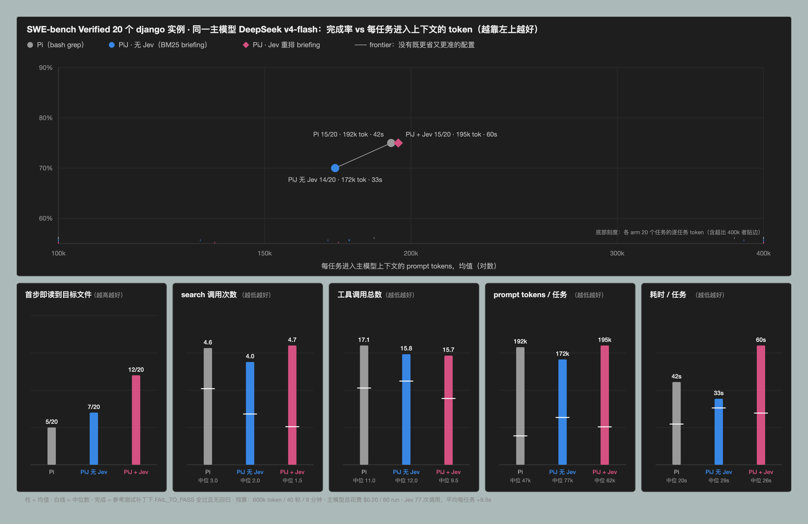

# End to end: Pi vs PiJ on SWE-bench Verified with one main model

Stage 1 (`docs/swebench-retrieval-experiment.md`) established that Jev reranking puts the file
that must be edited in front of the agent far more reliably than BM25. This experiment asks
the only question that matters after that: does it change what a coding agent actually does
and achieves on a real task?

## Setup

- **Instances**: 20 `django/django` instances from SWE-bench Verified. Candidates were
  pre-screened (`eval/swebench-agent-results/oracle-screen.txt`): in this environment the
  unfixed tree must fail at least one FAIL_TO_PASS test and the gold patch must pass all of
  them. 20 of 22 candidates passed; `django__django-10097` (broad FAIL_TO_PASS list that
  already passes here) and `django__django-11276` (needs docutils) were excluded.
- **Main model**: `deepseek-v4-flash` via Pi's built-in DeepSeek provider, thinking off,
  identical for every arm. Budget per run: 40 turns, 600k tokens, 9 minutes.
- **Arms**, all on the same prompt, workspace and sandbox:
  - **Pi** — plain `pi`, no extension. Searching means bash `grep`/`rg`/`find`.
  - **PiJ, no Jev** — `pij --jev-mode off` with `PIJ_SOURCE_BRIEFING=1`: the BM25
    shortlist from `discoverCode` is injected as an initial briefing and `pij_search`
    returns BM25 order. No Jev requests.
  - **PiJ + Jev** — `pij --jev-mode assist` with the briefing: the same shortlist, reranked
    by Jev before injection; `pij_search` also reranked.
- **Oracle**: the reference test patch is applied on top of the agent's change and the
  modules named by FAIL_TO_PASS and PASS_TO_PASS are run (Python 3.8, editable install).
  *Resolved* = every FAIL_TO_PASS test passes and no PASS_TO_PASS test regresses.
- **Effort**: every tool call is classified by what it does (`classify()` in
  `eval/swebench-agent.ts`): `pij_search` and bash `grep|rg|find|ls…` are *search*; `read`
  and bash `cat|head|sed -n…` are *read*; `runtests.py|pytest` is *test*.

Harness: `eval/swebench-agent.ts`. Raw per-run records, patches and summary:
`eval/swebench-agent-results/`. 60 runs, 0 harness errors, $0.20 of main-model spend in total.

## Results

| | Pi | PiJ, no Jev | PiJ + Jev |
|---|---:|---:|---:|
| **resolved** | **15/20** | 14/20 | **15/20** |
| FAIL_TO_PASS passed | 16/20 | 15/20 | 16/20 |
| edited a gold file | 18/20 | 18/20 | 18/20 |
| token budget exhausted | 4 | 3 | 5 |
| **first tool call reads a gold file** | 5/20 | 7/20 | **12/20** |
| search calls, mean / median | 4.6 / 3.0 | 4.0 / 2.0 | 4.7 / **1.5** |
| tool calls, mean / median | 17.1 / 11.0 | 15.8 / 12.0 | 15.7 / **9.5** |
| prompt tokens per task, mean / median | 192k / **47k** | 172k / 77k | 195k / 62k |
| wall time per task, mean / median | 42 s / 20 s | **33 s** / 29 s | 60 s / 26 s |
| Jev requests per task | — | — | 3.9 (+9.5 s) |

Paired against plain Pi on the same instance, PiJ + Jev used **fewer search calls on 8,
the same on 7, more on 5**; fewer tool calls on 12 of 20; but more prompt tokens on 12 of 20
and more wall time on 15 of 20.

## What happened

**The retrieval advantage did reach the agent.** With the Jev-ranked briefing, the very first
action reads the file that the reference patch edits in 12 of 20 runs, against 5 of 20 for
plain Pi and 7 of 20 for the BM25 briefing. That is the Stage 1 result showing up end to end,
and it is the one metric on which the three arms clearly separate.

**It did not change the outcome.** Resolve rate is identical (15/20 vs 15/20). Two things
explain the gap between "pointed at the right file" and "solved the task":

1. **The model ignored `pij_search`.** Across all 40 PiJ runs, `pij_search` was called
   twice. DeepSeek-flash searches the way it always searches — bash grep — regardless of an
   opt-in tool being offered. So the only channel through which Jev ranking reached the
   agent was the one-off briefing; every later search was lexical in every arm.
2. **Variance after localization dominates.** On 9 of 20 instances plain Pi needed fewer than
   three searches: the issue text names the file, and retrieval is not the bottleneck. On the
   instances where it was, the arms diverge both ways. `django__django-11206`: Pi spent 37
   tool calls and 414k tokens, PiJ + Jev 9 calls and 65k, both resolved. `django__django-11239`:
   5 searches became 0. But `django__django-11087`: Pi resolved it in 55 s with 5 searches
   while PiJ + Jev, having read the right file first, went on to 18 searches, exhausted its
   budget at 280 s and did not resolve it. Medians move in PiJ's favour (searches 3 → 1.5,
   tool calls 11 → 9.5); a few runaway runs erase the difference in the means.

**Jev is not free at this model's speed.** deepseek-v4-flash answers in about a second, so
~3.9 Jev requests per task at ~2.4 s each, plus a 6,000-file discovery pass, add roughly 18 s
to a 42 s task. The same latency was negligible against Sonnet-class response times in the
earlier experiments; it is not negligible here.

## What this changes

The position — rerank a lexical shortlist, keep the ranker out of the context window — is
still right: it is the only arm whose first move lands on the right file more often than not.
What is wrong is the **delivery**. An opt-in tool the model does not pick up delivers nothing
after turn one. The evidence points at one design: put the reranker inside the search path
the model already uses — intercept the `grep`/`rg` results it asks for and rerank *those*, or
make the search tool the model reaches for be the ranked one — rather than offering a
parallel tool and hoping it is chosen. That is also where the latency has to be paid for: a
ranked grep result is worth 2 s only if it removes more than 2 s of subsequent searching.

## Limitations

- 20 instances, one repository, one main model, one run per configuration. A single
  runaway run moves a mean by 10%.
- The task set is easy for localization: 9 of 20 instances needed fewer than three searches
  for plain Pi. A set chosen for retrieval difficulty (Stage 1 knows which instances rank
  poorly under BM25) would test the hypothesis more sharply.
- `pij_search` adoption may differ across main models; this result is specific to
  deepseek-v4-flash's tool-selection habits.
- One run per arm hit a transient DeepSeek "Connection error" that Pi retried; the run
  completed normally and is counted as such.
