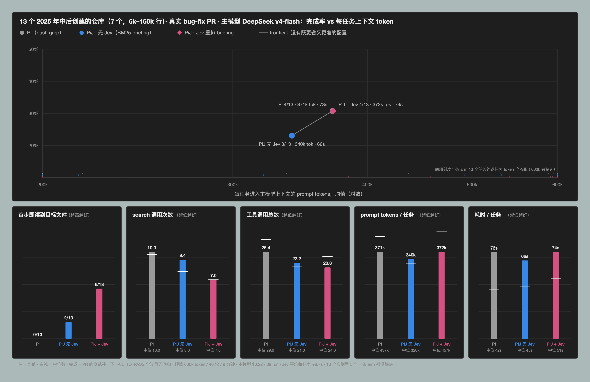
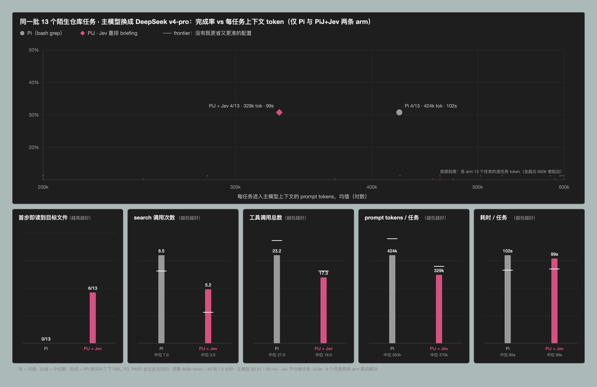

# Pi vs PiJ on repositories the model has not memorised

The django experiment (`swebench-agent-experiment.md`) ended with a diagnosis: on 13 of 20
instances plain Pi opened the right file after at most one search, because the model knows
django's layout from training. A retrieval tool cannot show its value where retrieval is not
needed. This experiment moves to code the model is unlikely to have seen.

## Task construction

- **Repositories**: GitHub search for Python repositories created after 2025-06 with 60–1500
  stars, excluding lists, proxies, tutorials and the like (`eval/unfamiliar/scout.py`).
- **Tasks**: merged PRs whose title reads as a bug fix, touching at most six files and at
  most 400 changed lines, with both library code and tests among the changed files. The PR
  diff is split into the code patch and the test patch (`fetch_prs.py`).
- **Oracle screening** (`screen.py`): checkout base, install (`[test]`/`[dev]`/plain
  editable, or requirements files), apply the test patch and run the PR's test files with
  pytest — at least one test must fail; then apply the code patch — all of them must pass.
  63 candidates → **13 instances from 7 repositories** (20 had no fail→pass flip, 16 would not
  install, 11 collected no tests, 3 other).
- **Problem statement**: the linked issue when the PR closes one (6 of 13); otherwise the PR
  title and body with code blocks removed. Three statements name the file to edit; ten do not.
- **Corpora**: 6k–150k lines of Python (connectonion 108k, unifideck 121k, Zetta-Embodiment
  150k, EvoSkill 23k, reverify 15k, torrra 10k, pinchbench/skill 6k). Created 2025-07 to 2026-08.
- Everything else as in the django experiment: deepseek-v4-flash, same prompt, same sandbox,
  same budgets, three arms (plain Pi; PiJ with the BM25 briefing and no Jev; PiJ with the
  Jev-ranked whole-file briefing, v4). Instances: `eval/unfamiliar/instances.json`. Results:
  `eval/swebench-agent-results/unfamiliar/`. 39 runs, one rerun after a harness buffer
  overflow (an agent vendored a dependency into its workspace), $0.22 of main-model spend.

## Results

| | Pi | PiJ, no Jev | PiJ + Jev |
|---|---:|---:|---:|
| **resolved** | 4/13 | 3/13 | 4/13 |
| edited a gold file | 10/13 | 12/13 | 11/13 |
| token budget exhausted | 4 | 4 | 4 |
| **first tool call reads a gold file** | **0/13** | 2/13 | **6/13** |
| search calls, mean / median | 10.3 / 10 | 9.4 / 8 | **7.0 / 7** |
| tool calls, mean / median | 25.4 / 29 | 22.2 / 21 | **20.8 / 24** |
| prompt tokens per task | 371k | **340k** | 372k |
| wall time per task | 73 s | **66 s** | 74 s |
| Jev requests per task | — | — | 4.2 (+8.7 s) |

Paired against plain Pi: PiJ + Jev used fewer search calls on 8 of 13, fewer tool calls on
**11 of 13**, and took less wall time on 9 of 13 even carrying 8.7 s of Jev latency.

Phase split (localize / comprehend / verify):

| | Pi | PiJ, no Jev | PiJ + Jev |
|---|---:|---:|---:|
| L calls | 7.7 | **4.7** | 7.1 |
| C calls | 11.2 | 11.1 | **8.7** |
| L + C | 18.9 | 15.8 | 15.8 |
| V calls | 6.5 | 6.4 | **5.1** |

## Reading

**On unfamiliar code the localisation effect is no longer marginal.** Plain Pi never opens
the right file first (0 of 13, against 5 of 20 on django); with the Jev-ranked briefing it
does so on 6 of 13. Searching drops by a third (10.3 → 7.0) and total tool calls by 18%, and
— unlike django — the comprehension phase shrinks too (11.2 → 8.7), so calls before the
first edit fall from 18.9 to 15.8. The Jev arm is the only one that is not slower than Pi
despite paying for its requests.

**It still does not change what gets solved.** 4/13 in both. Five instances were solved by
no arm and four by every arm; the outcome is set by whether deepseek-v4-flash can produce the
fix, not by whether it finds the file — plain Pi edited a gold file on 10 of 13 after its
ten searches. Localisation is achievable by grep on every task here; PiJ makes it cheaper,
not possible.

**Prompt tokens are flat** (371k vs 372k) because four runs per arm exhaust the 600k budget
and dominate the mean; the medians move the other way (437k vs 457k). Wall time is flat for
the same reason.

## The same tasks with a stronger main model (deepseek-v4-pro)

Plain Pi and PiJ + Jev only (26 runs, $0.51); `eval/swebench-agent-results/unfamiliar-pro/`.

| | Pi | PiJ + Jev |
|---|---:|---:|
| **resolved** | 4/13 | 4/13 |
| FAIL_TO_PASS passed | 4 | 5 |
| token budget exhausted | 5 | **3** |
| **first tool call reads a gold file** | 0/13 | **6/13** |
| search calls, mean / median | 8.5 / 7 | **5.2 / 3** |
| tool calls | 23.2 | **17.3** |
| prompt tokens per task | 424k | **329k** |
| wall time | 102 s | 99 s |
| L / C / V calls | 4.4 / 11.9 / 6.8 | 6.3 / **5.4** / 5.6 |
| reads of a gold file, all runs | 40 | **28** |

Paired: fewer searches on 11 of 13, fewer tool calls on **12 of 13**, fewer prompt tokens
on 8 of 13. With the stronger model the effect is larger on every effort axis than with
flash — searches −39%, tool calls −25%, and now prompt tokens −22% too, because two fewer
runs exhaust the budget. The comprehension phase, which flash barely shortened, halves
(11.9 → 5.4): the stronger model acts on the briefing instead of re-deriving it. Jev latency
per task fell to 3.6 s, so the Jev arm is not slower.

Outcome is still 4/13 each, but not the same four: PiJ + Jev resolved `connectonion-1556`
(a five-file fix plain Pi ran out of budget on) and lost `Zetta-Embodiment-23` to a
PASS_TO_PASS regression after passing its FAIL_TO_PASS tests. Eight of the thirteen tasks
were solved by no arm under either model. The stronger model did not raise the floor: the
same five or six tasks are solvable and the rest are not, for reasons that are not
localisation.

## What would move the outcome

The resolve rate can only separate arms on tasks in the band "solved if the file is found,
not solved otherwise". This set has few such tasks: most failures are fix failures, and a
model tier up did not change which tasks fall in that band. Two things would sharpen the
test: a far stronger main model, so that finding the file is the binding constraint more
often; and larger, more foreign codebases where grep localisation genuinely fails — here it
still succeeded on 9–10 of 13. Both are affordable: these runs cost $0.22 and $0.51.

## Limitations

- 13 instances, 7 repositories, one run each. Outcome differences of one task are noise.
- Repositories with 1,200–1,500 stars created within the last 15 months are *less* familiar
  than django, not unknown; the model's training cutoff is not published.
- Several repositories are agent frameworks and tooling — the kind of code most abundant in
  recent training data — rather than libraries with long-established layouts.
- Three of thirteen statements name the file to edit.
